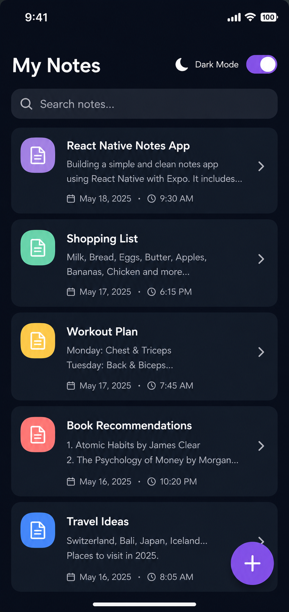
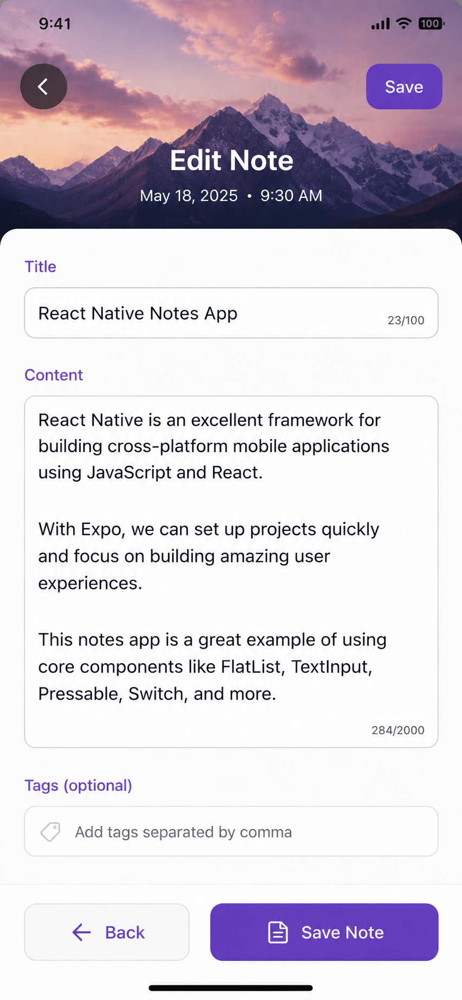

# React Native Notes App 📝

A clean, polished notes app built with React Native + Expo. It includes a notes list view and a note editor view with full light/dark mode styling, responsive padding, and subtle UI details that match the provided designs.

## Screenshots

| Notes List | Note Editor |
| --- | --- |
|  |  |

## Features

- Two stacked screens (list + editor) 
- Dark and light mode styling
- Search bar, floating action button, and card list UI
- Image header, character counters, and tag input
- Responsive layout using `useWindowDimensions`

## Project Structure

```
notes-app/
├── src/
│   └── app/
│       ├── _layout.tsx
│       └── index.tsx
├── screens/
│   ├── NotesListScreen.js
│   └── NoteEditorScreen.js
├── assets/
│   └── mountain.jpg
├── view01.png
├── view02.png
└── README.md
```

## Run Locally

1. Install dependencies

   ```bash
   npm install
   ```

2. Start the app

   ```bash
   npx expo start
   ```


